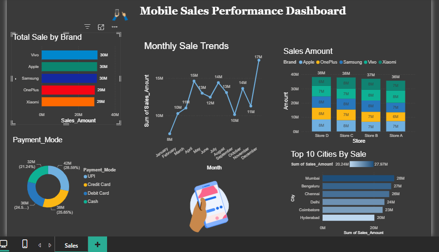

# 📱 Mobile Sales Power BI Dashboard

A Power BI dashboard to analyze mobile sales performance across brands, stores, cities, and payment modes for FY 2025-26.

## 🎯 Project Overview
This dashboard helps sales & marketing teams track mobile sales trends, identify top-performing brands/cities, and understand customer payment behavior.

## 📊 Key Visuals & Insights

| Visual | Insight |
| --- | --- |
| **Total Sale by Brand** | Top 3 brands Vivo, Apple, Samsung at ~30M each |
| **Monthly Sale Trends** | Peak in April & December at 17M |
| **Sales by Store** | Store D highest with 38M |
| **Top 10 Cities** | Mumbai leads at 28M |
| **Payment Mode** | UPI 26.59% is #1 |

## 🛠️ Tech Stack
- **Power BI Desktop** - Visualization & DAX
- **Power Query** - Data cleaning
- **Excel/CSV** - Data source

## 🚀 How to Run
1. Clone this repo
2. Open `Mobile_Sales_Dashboard.pbix` in Power BI Desktop
3. Refresh data & use slicers

## 👨‍💻 Author
Anusha Arithas | [LinkedIn] www.linkedin.com/in/anusha-arithas-60a049332
